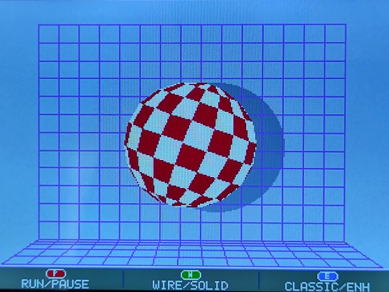
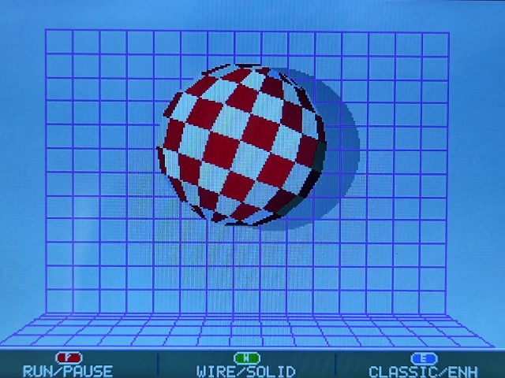
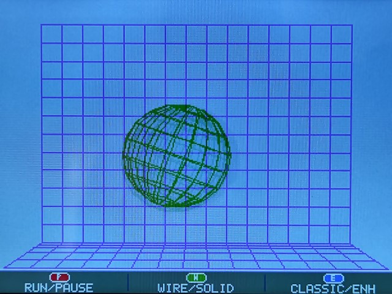
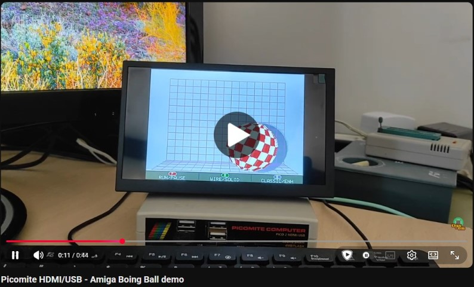

# Boing Ball for PicoMite HDMI/USB

A small MMBasic recreation of the classic Amiga Boing Ball demo for PicoMite HDMI/USB.

I made it because I wanted to explore the 3D features of MMBasic and PicoMite, and I could not think of a better excuse than paying homage to the Amiga I have loved all my life, and to the engineers behind that remarkable machine.

The goal is not a line-by-line port of the original code, but a small homage that recreates the feel of the demo with clear PicoMite-native MMBasic, allowing a few restrained variations where they suited the platform, such as a real 3D ball object, a modest Z-axis motion pass, and a restrained lighting/shading pass for the enhanced presentation.

Original Amiga demo programming: Dale Luck and Robert J. Mical (R.J.).

---

This version is programmed for PicoMite firmware 6.02.01 on the PicoMite HDMI/USB RP2350A platform. It has been checked after `OPTION RESET HDMIUSB`, using the default options from the firmware.

This demo targets the PicoMite HDMI/USB RP2350A platform only. It requires the HDMI/USB MODE 5 video path and depends on the framebuffer flow and palette behavior of that target, so it should be treated as HDMI-only rather than a generic PicoMite release.

---

## Gallery

<table>
	<tr>
		<td align="center">
			
			 
			Classic mode
		</td>
		<td align="center">
			
			 
			Enhanced mode
		</td>
	</tr>
	<tr>
		<td align="center">
			
			 
			Wireframe mode
		</td>
		<td align="center">
			
			 
			Youtube video
		</td>
	</tr>
</table>

---

## Repo layout

- `boingball.bas`: MMBasic program
- `boing_side.wav`: side rebound cue
- `boing_floor.wav`: floor rebound cue
- `README.md`: brief project note and target details

License: MIT
